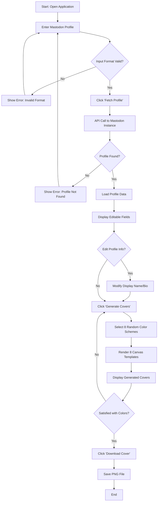
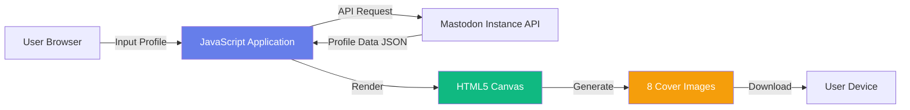

# 🎨 xsukax Mastodon Profile Cover Generator

A privacy-focused, client-side web application that creates stunning, professional cover images for Mastodon profiles. Generate eight unique luxury-themed designs instantly without uploading your data to any server.

**Live Demo:** [https://xsukax.github.io/xsukax-Mastodon-Profile-Cover-Generator](https://xsukax.github.io/xsukax-Mastodon-Profile-Cover-Generator)

---

## 📋 Project Overview

The **xsukax Mastodon Profile Cover Generator** is a single-page web application designed to help Mastodon users create visually appealing profile cover images with minimal effort. By fetching public profile information directly from Mastodon instances via their public API, the application generates eight distinct cover designs featuring customizable color schemes, gradient effects, and optional avatar integration.

The application emphasizes user privacy by performing all operations client-side in the browser—no data is transmitted to external servers beyond the initial profile fetch from the user's chosen Mastodon instance.

### Key Functionalities

- **Profile Fetching:** Retrieve public profile data (username, display name, bio, avatar) from any Mastodon instance using the standard Mastodon API
- **Design Generation:** Create eight professionally designed cover templates with randomized luxury color schemes
- **Customization:** Edit profile information before generating covers to personalize the output
- **Download:** Export generated covers as high-quality PNG images (1500×500 pixels) suitable for Mastodon profiles

---

## 🔒 Security and Privacy Benefits

### Client-Side Processing
All image generation, manipulation, and rendering occur entirely within your browser using HTML5 Canvas API. Your profile data never leaves your device except for the initial API call to fetch public information from your Mastodon instance.

### No Data Collection
The application does not collect, store, or transmit any personal information to third-party servers. There are no analytics, tracking cookies, or backend databases involved.

### Direct API Communication
Profile data is fetched directly from Mastodon instances using their public API endpoints (`/api/v1/accounts/lookup`). The application acts as a client-side interface without intermediary servers that could log or intercept your information.

### CORS-Compliant Avatar Loading
When loading profile avatars, the application uses the `crossOrigin = 'anonymous'` attribute to ensure images are fetched without credentials, preventing potential privacy leaks through cookie transmission.

### Open Source Transparency
The entire application source code is publicly available for audit, allowing security researchers and privacy-conscious users to verify that no malicious code or data exfiltration mechanisms exist.

### No Server Dependencies
As a static HTML file with embedded JavaScript, the application can be run locally by simply opening the HTML file in a browser, eliminating dependency on external hosting or CDN availability (except for Tailwind CSS).

---

## ✨ Features and Advantages

### Design Excellence
- **Eight Premium Templates:** Luxury Minimal, Royal Elegance, Premium Glow, Executive Wave, Prestige Geometric, Celestial Aura, Apex Tech, and Opulent Flow
- **Dynamic Color Schemes:** 34 carefully curated color palettes (20 light, 14 dark premium) with professional gradient combinations
- **Randomized Colors:** Each generation cycle selects new random color schemes, ensuring unique results every time
- **Avatar Integration:** Automatically incorporates your Mastodon profile avatar with elegant circular framing and glow effects

### User Experience
- **Instant Generation:** Create all eight cover designs simultaneously in under a second
- **Flexible Input:** Supports multiple Mastodon profile formats (full URL or @username@instance format)
- **Editable Fields:** Modify display name and bio before generation without re-fetching profile data
- **One-Click Download:** Export individual covers as PNG files with descriptive filenames
- **Responsive Design:** Clean, modern interface built with Tailwind CSS that works on desktop and mobile devices

### Technical Advantages
- **Zero Configuration:** No installation, dependencies, or build process required—just open and use
- **Offline Capable:** After initial load, works offline for profile editing and cover regeneration (requires online connection only for profile fetching)
- **Browser Compatibility:** Works with all modern browsers supporting HTML5 Canvas (Chrome, Firefox, Safari, Edge)
- **Lightweight:** Single-file application under 50KB (excluding external Tailwind CSS CDN)

### Privacy-First Architecture
- **No Backend Required:** Eliminates potential server-side vulnerabilities and data breach risks
- **No Authentication Needed:** Fetches only public profile information without requiring OAuth tokens or passwords
- **Local Processing:** All computationally intensive operations handled client-side

---

## 🚀 Installation Instructions

### Option 1: Use the Hosted Version (Recommended)
Visit the live demo at [https://xsukax.github.io/xsukax-Mastodon-Profile-Cover-Generator](https://xsukax.github.io/xsukax-Mastodon-Profile-Cover-Generator) and start using the application immediately without any installation.

### Option 2: Run Locally

#### Prerequisites
- A modern web browser (Chrome 90+, Firefox 88+, Safari 14+, or Edge 90+)
- No additional software or dependencies required

#### Steps

1. **Clone the Repository**
   ```bash
   git clone https://github.com/xsukax/xsukax-Mastodon-Profile-Cover-Generator.git
   cd xsukax-Mastodon-Profile-Cover-Generator
   ```

2. **Open the Application**
   - Simply double-click `index.html` to open it in your default browser
   - Or right-click `index.html` → "Open with" → choose your preferred browser

3. **Alternative: Run with a Local Web Server (Optional)**
   
   While not required, using a local web server can improve the development experience:
   
   Using Python 3:
   ```bash
   python -m http.server 8000
   ```
   
   Using Python 2:
   ```bash
   python -m SimpleHTTPServer 8000
   ```
   
   Using Node.js (with `http-server` package):
   ```bash
   npx http-server -p 8000
   ```
   
   Using PHP:
   ```bash
   php -S localhost:8000
   ```
   
   Then navigate to `http://localhost:8000` in your browser.

#### PHP Configuration Notes
If you choose to serve the application using PHP's built-in web server, no special `php.ini` configuration is required. The application is entirely client-side JavaScript and does not execute any PHP code. Standard PHP settings are sufficient for serving static HTML files.

---

## 📖 Usage Guide

### Application Workflow



### Step-by-Step Instructions

#### 1. Enter Your Mastodon Profile

The application accepts two input formats:

- **Full URL:** `https://instance.com/@username`
  - Example: `https://infosec.exchange/@xsukax`
  
- **Full Username:** `@username@instance.com`
  - Example: `@xsukax@infosec.exchange`

Enter your profile information in the text field at the top of the page.

#### 2. Fetch Profile Data

Click the **"Fetch Profile"** button to retrieve your public profile information from your Mastodon instance. The application will:

- Validate your input format
- Connect to the specified Mastodon instance
- Retrieve your username, display name, bio, and avatar
- Display editable fields with your profile information

**Note:** You can also click **"Try Example"** to load the developer's profile as a demonstration.

#### 3. Edit Profile Information (Optional)

After fetching, you can modify:

- **Display Name:** The name shown prominently on your cover
- **Bio:** The descriptive text included in most templates

The username field is read-only to maintain accuracy.

#### 4. Generate Cover Images

Click **"Generate Covers"** to create eight unique cover designs. The application will:

- Select eight random color schemes from the 34 available palettes
- Render each of the eight templates with your profile data
- Apply your avatar (if available) with appropriate styling
- Display all covers in a grid layout

**Tip:** Click "Generate Covers" multiple times to try different color combinations—each generation randomizes the color schemes.

#### 5. Download Your Favorite Covers

Browse the generated designs and click **"Download Cover"** on any template card to save it as a PNG file. The filename will include:

- Your username (sanitized)
- Template name
- Timestamp

Example: `mastodon-cover-xsukax-luxury-minimal-1702123456789.png`

### Architecture Overview



### Template Descriptions

1. **Luxury Minimal:** Sophisticated gradient backgrounds with subtle accent circles and clean typography
2. **Royal Elegance:** Regal geometric accents with metallic gradient bars and triangular elements
3. **Premium Glow:** Luminous radial gradients creating ethereal atmospheric effects
4. **Executive Wave:** Dynamic wave patterns flowing across the canvas with professional polish
5. **Prestige Geometric:** Precision geometric shapes (triangles, circles, rectangles) with luxe details
6. **Celestial Aura:** Multiple ethereal glows creating cosmic elegance
7. **Apex Tech:** High-tech grid pattern with monospace fonts and corner brackets
8. **Opulent Flow:** Flowing circular gradient patterns creating artistic movement

---

## 📄 License

This project is licensed under the GNU General Public License v3.0.

---

## 🙏 Acknowledgments

- Built with modern web technologies: HTML5 Canvas API, JavaScript ES6+, and Tailwind CSS
- Inspired by the need for privacy-respecting tools in the Fediverse community
- Designed for Mastodon users who value both aesthetics and data protection

---

## 🤝 Contributing

Contributions, issues, and feature requests are welcome! Feel free to check the [issues page](https://github.com/xsukax/xsukax-Mastodon-Profile-Cover-Generator/issues) or submit pull requests.

### Development Guidelines

- Maintain client-side-only architecture (no backend dependencies)
- Ensure all features respect user privacy
- Test across multiple browsers before submitting PRs
- Follow existing code style and conventions

---

## 📧 Support

If you encounter issues or have questions:

- Open an issue on [GitHub Issues](https://github.com/xsukax/xsukax-Mastodon-Profile-Cover-Generator/issues)
- Check existing issues for solutions
- Provide detailed information (browser version, error messages, steps to reproduce)

---

**Made with ❤️ for the Mastodon community**
